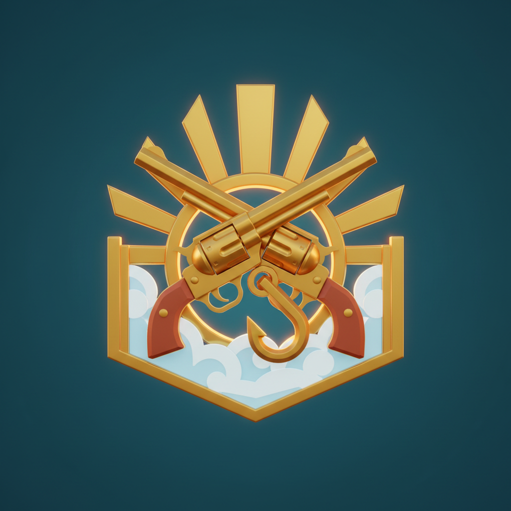
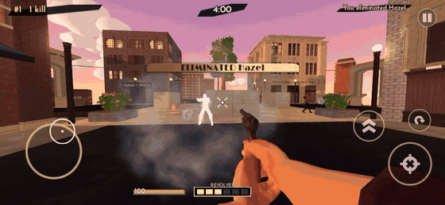
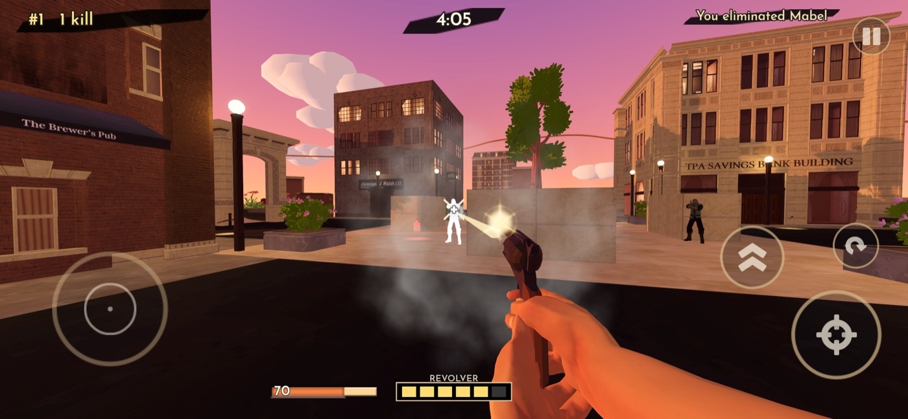
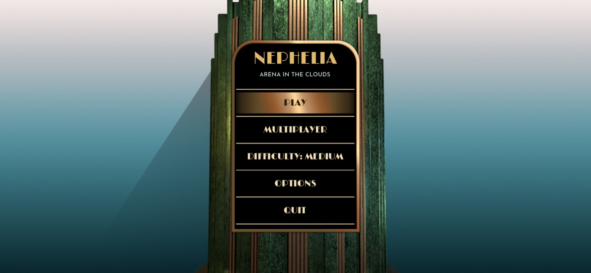

<p align="center">
  
</p>

<h1 align="center">Nephelia</h1>

<p align="center">
  <b>Arena in the Clouds</b><br>
  A fast, frantic first-person shooter for mobile, set in a floating city from the early 1900s.
</p>

<p align="center">
  
  
  
  
</p>

<p align="center">
  
</p>

## The game

Short free-for-all matches on three city blocks floating above a sea of clouds. Fall off the
island and you die. Stay on it and you shoot, grab the hook and ride the sky rails to drop on
someone on the other side.

- **Quick matches:** 5 minutes or 15 kills. There are always 4 characters in the arena: bots
  fill the empty slots, and anyone who joins takes a bot's place.
- **Sky Plaza:** a central square and two neighborhoods, one with houses and a park and one with
  shops, plus a bank, a hotel, a pub, a bakery and brick tenements. Bridges link the three blocks,
  and other islands float on the horizon.
- **Sky rails:** a hook button shows up near a rail. Your character latches on, slides along
  hanging from it and lets go wherever you want.
- **Weapons:** the revolver is always in hand. The repeater rifle and the shotgun show up as
  pickups in the arena, along with tonic bottles that restore health.
- **Bots** with three difficulty levels. They see, chase, keep away from the edges, go after
  health and weapons, and ride the rails, using the same commands as the player (no cheating).
- **Afternoon to night:** the light follows the match clock, from golden sunlight to sunset to a
  starry night. Street lamps and windows light up.
- **Multiplayer for up to 4 people:** on the same Wi-Fi (rooms show up on their own, no address to
  type) or online with the **PLAY ONLINE** button, with iPhone, Android and computer players in the
  same match.
- **FUNNY SOUNDS:** meme sounds made for the project, played at key moments of the match. They can
  be turned off in the options.
- The game's text is English only.

<p align="center">
  
  
</p>

## Status

| Platform | Status |
|---|---|
| iPhone and iPad | Version 1.0 archived for the App Store (paid game). Version 1.1 brings the new city, 8-direction running, the meme sounds and online play. |
| Android | Test APK ("Android" preset). Google Play later. |
| Mac | Development and testing. |
| Steam (Windows, Mac, Linux) | Planned. A PC control mode is still missing. |

The full plan, with what is done and what is left, is in [PLANO.md](PLANO.md) (in Portuguese).

## Controls

| Action | Touch | Keyboard and mouse | Gamepad |
|---|---|---|---|
| Move | Joystick on the left (appears where your finger lands) | `W` `A` `S` `D` or arrow keys | Left stick |
| Look | Drag anywhere else on the screen | Mouse | Right stick |
| Shoot | Crosshair button | Left mouse button | Right trigger |
| Jump | Double-arrow button | `Space` | `A` |
| Reload | Reload button | `R` | `X` |
| Rail hook | Hand button (only shows up with a rail in reach) | `E` | `Y` |
| Pause | Pause button | `Esc` | `Start` |

With touch and gamepad, aiming gets a little assistance. Every command goes through Godot's Input
Map, never a hard-coded key.

## Running the project

1. Install **Godot 4.7.2** (standard version, not .NET).
2. Open `project.godot` and press **F5**. The game starts at the main menu.

On the Mac the project ships with *Emulate Touch From Mouse* turned on, so you can test the touch
controls with the mouse. To test multiplayer on a single machine, use **Debug → Customize Run
Instances** with 2 windows: one hosts and the other joins (the room shows up on its own).

Tech: Godot 4.7.2, statically typed GDScript, Jolt physics and the Mobile renderer.

## Tests

There are 7 headless test suites (121 tests). Exit code 0 means everything passed.

```bash
GODOT=~/Downloads/Godot.app/Contents/MacOS/Godot
for suite in test_controls test_bots test_arena test_items test_menus test_audio test_net; do
  "$GODOT" --headless --path . -s "res://tests/$suite.gd" || echo "FAILED: $suite"
done
```

The `test_net` suite launches extra Godot processes to play over a real network. The end-to-end
online tests (N22 and N23) need Node.js 24 and the server repository cloned next to this one
(`../nephelia-server`); without them, those two tests are skipped.

## Multiplayer and online

- **Same Wi-Fi:** one device hosts and acts as the match server (ENet, UDP). The others find the
  room on their own: the game asks every address on the local network.
- **Online:** the PLAY ONLINE button asks the matchmaker, hosted on Render, for a match. The match
  itself is the game running without a screen (a dedicated server), and the connection goes over
  WebSocket.
- **Shared by both modes:** a custom protocol (commands 60 times per second, state snapshots 30
  times per second), prediction of your own movement, lag compensation for shots, and bots filling
  the empty slots.

The matchmaker lives in a separate repository:
[nephelia-server](https://github.com/ItsJuniorDias/nephelia-server) (Node.js + TypeScript).

> **Network version:** `NetMessage.VERSION` (in `net/net_message.gd`) goes up whenever the
> protocol **or the arena** changes, together with the server's `protocolVersion`. Devices on
> different versions can't play together: both need the same build.

## Exporting

Export with the editor **closed**: exporting from the editor rewrites `export_presets.cfg` with
whatever it has in memory. In the commands below, `$GODOT` is the Godot executable (as in the Tests
section).

**iOS** (Xcode and an Apple Developer account): the preset only generates the Xcode project,
outside the game folder.

```bash
"$GODOT" --headless --path . --export-release "iOS" ~/Builds/nephelia_ios/Nephelia.ipa
cd ~/Builds/nephelia_ios
xcodebuild -project Nephelia.xcodeproj -scheme Nephelia -sdk iphoneos -configuration Release \
  -destination generic/platform=ios archive -allowProvisioningUpdates \
  -archivePath ~/Builds/nephelia_ios/Nephelia.xcarchive
open Nephelia.xcarchive   # Distribute App > App Store Connect
```

**Android** (OpenJDK 17 and the Android SDK; set their paths in *Editor Settings → Export →
Android*):

```bash
"$GODOT" --headless --path . --export-debug "Android" ~/Builds/nephelia_android/Nephelia.apk
```

The preset needs the **Internet**, **Access Network State** and **Access Wifi State**
permissions. Without the Internet permission, Android silently blocks every connection (neither
online nor Wi-Fi play works).

**Online match server** ("Linux Server" preset: the game without art, only the logic):

```bash
"$GODOT" --headless --path . --export-pack "Linux Server" ../nephelia-server/game/nephelia_server.pck
```

Then commit it in `nephelia-server` after every network or match change: the server must run the
same code as the players.

## Tools

Much of the content is generated by scripts in `tools/` (run them with
`Godot --path . -s <script>`; each one explains its usage in its header).

| Script | What it does |
|---|---|
| `build_skyplaza.gd` | Builds the whole arena in code: blocks, bridges, rails, pickups, clouds and skyline |
| `city_kit.gd` | Assembles the building facades piece by piece (Downtown City MegaKit) |
| `bake_navmesh.gd` | Bakes the bots' navigation mesh (run it again after changing the map) |
| `bake_characters.gd`, `bake_weapons.gd` | Prepare the character bodies and the weapon meshes |
| `extract_bot_animations.gd` | Extracts the animations the game uses from the Universal Animation Library |
| `make_menus.gd`, `make_theme.gd` | Build the screens and the UI theme |
| `prepare_sounds.py`, `make_meme_sounds.py` | Prepare the sounds and synthesize the meme sounds |
| `store_screenshots.gd`, `app_preview.gd` | App Store screenshots and preview video, at the exact sizes |
| `*_sheet.gd` | Photo sheets to review characters, poses, effects, sky, city and UI |

## Folder structure

```
assets/       third-party files (models, textures, sounds, fonts, UI)
audio/        game sounds and meme sounds
autoload/     options saved on the device (Settings)
bots/         bot controller and difficulty levels
characters/   character, model, outfits, animations and effects
items/        arena pickups (tonics and weapons)
levels/       Sky Plaza arena, sky, navigation
match/        match referee and free-for-all mode
net/          multiplayer: Wi-Fi, online, dedicated server
player/       player controller (touch, keyboard and gamepad)
rails/        sky rails
store/        App Store texts, privacy policy and support page
tests/        automated tests
tools/        generators and review tools
ui/           menus, HUD, lobby, credits, theme and icon
vfx/          visual effects
weapons/      weapons, shooting and first-person arms
docs/         images for this README (ignored by Godot)
```

## Documentation

The project notes are in Portuguese:

- [CLAUDE.md](CLAUDE.md): detailed technical notes (how each system works and the pitfalls found
  along the way) and the project status.
- [PLANO.md](PLANO.md): tasks and roadmap.
- [CREDITS.md](CREDITS.md): every third-party asset, with author, license and link.
- [store/](store/): store texts, privacy policy and support page.

## Credits

Made by Alexandre de Paula Dias Junior.

Third-party assets (full list in [CREDITS.md](CREDITS.md) and on the in-game credits screen):

- **Quaternius** (CC0): Downtown City MegaKit, Stylized Nature MegaKit, Universal Base
  Characters, Universal Animation Library and Modular Character Outfits.
- **Kenney** (CC0): touch controls, particles and UI sounds.
- **LowPolyAssets** (CC0): Low Poly Wild West Guns.
- **JulioVII** (CC-BY): the park's grass texture.
- **iuliana-u**: Marble and Gold UI Kit (paid).
- **Fonts:** Limelight and Josefin Sans (SIL OFL), from Google Fonts.
- **Sounds:** CC0 sounds from OpenGameArt and Freesound.
- **Music:** Scott Joplin's *Maple Leaf Rag*, in public domain recordings.
- The game icon was generated with AI (declared in CREDITS.md).

## License

Nephelia's code and original content are not under an open source license: all rights reserved
by the author. Third-party assets follow the licenses listed in [CREDITS.md](CREDITS.md). The
Marble and Gold UI Kit is a paid asset, purchased for this game.
